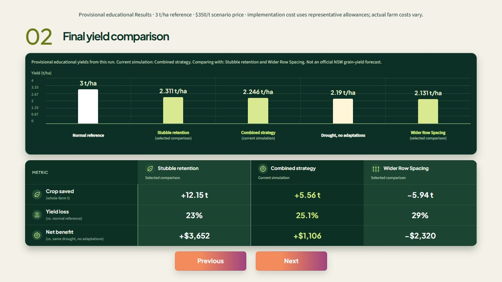
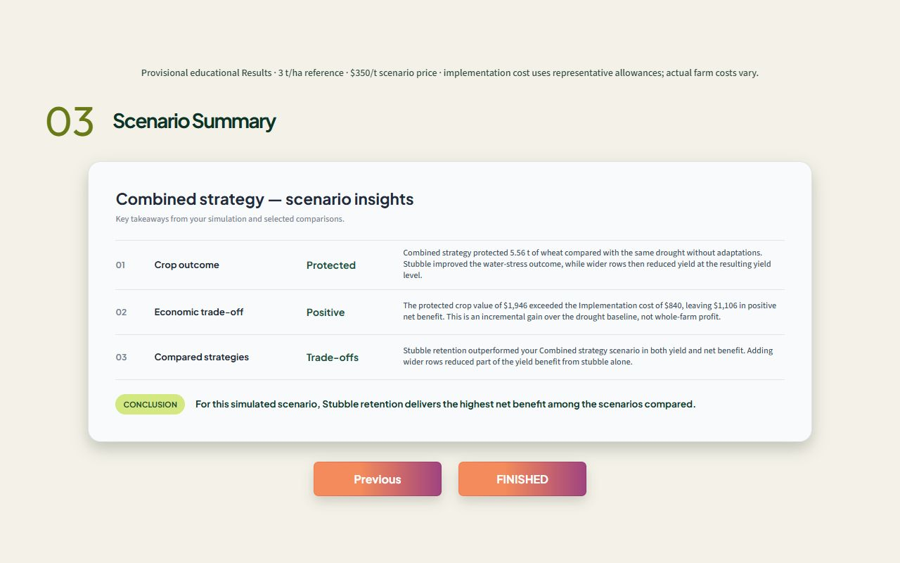

# Farm Forward

**You can’t prevent drought. You can prepare for it.**

Farm Forward is an interactive drought resilience simulator that helps NSW wheat farmers visualise drought impacts, compare adaptation strategies and explore more informed decisions before the next dry season.

**Current release: 4 October 2026 (Australia/Sydney).** This repository contains the complete frontend and backend, including the finished Results experience, required assets and bundled data.

## The Problem

Drought reduces soil moisture, crop yields and farm income. Although resilience strategies are available, climate and agricultural information can be complex and difficult for farmers to apply to their specific conditions.

Farm Forward makes this information visual, practical and easier to understand.

## What We Built

Farm Forward allows users to enter key farm characteristics and explore how different drought scenarios and adaptation strategies could affect their farm.

The simulator starts from official NSW Combined Drought Indicator data, including rainfall, soil water and plant growth indices. It combines that baseline with farm information, educational drought scenarios and agricultural research to estimate possible changes in soil-water conditions, wheat yield and financial outcomes.

The official starting observations and the modelled future outcomes are distinct. The bundled CDI snapshot is dated **31 August 2026**; it is not a live data feed. Yield and financial calculations remain explicitly provisional educational estimates.

## Key Features

- Interactive drought resilience simulator.
- Customisable soil type, paddock size and water supply, including irrigation.
- Drought scenarios informed by the NSW Combined Drought Indicator.
- Comparison of stubble retention, wider row spacing and their combination against a consistent drought baseline.
- Visualisation of soil-water conditions, crop yield and financial impacts.
- Interactive 3D farm environment with synchronised crop, roots and water presentation.
- Scenario summaries explaining benefits, limitations and trade-offs using deterministic analysis of backend results, with optional AI wording support.
- Plain-language explanations and responsive design for users without technical modelling experience.

## How It Works

1. Select the farm location and enter its soil type, paddock size and water supply.
2. Select a drought scenario and adaptation strategy.
3. Run the simulation through twelve simulated weeks.
4. Visualise the potential effects on soil-water conditions, wheat yield and financial outcomes.
5. Compare the current strategy with the same-drought baseline and selected alternatives.
6. Review three scenario insights and a conclusion explaining the main results and trade-offs.

Farm Forward supports decision-making rather than prescribing one solution. Every farm has different conditions, priorities and constraints, so the simulator helps users explore their options before committing time and resources.

## Current Scope

The current prototype focuses on NSW wheat farming and two drought adaptation strategies: **stubble retention** and **wider row spacing**, which can also be combined. It demonstrates how climate and agricultural information can become an interactive decision-support experience.

The framework can later expand to support:

- Additional crops.
- More farming regions.
- Different drought scenarios.
- More resilience strategies.
- Advanced environmental and financial modelling.
- Tools for agricultural advisers and educators.

## Technologies Used

| Area | Current implementation |
|---|---|
| Frontend | HTML, CSS and plain JavaScript with DOM-based UI components |
| 3D visualisation | Three.js and TypeScript, with local GLB models |
| Backend | JavaScript Worker serving the website and same-origin calculation APIs; Node.js server for local use |
| Build and validation | esbuild, TypeScript and Node.js’s built-in test runner |
| Data modelling | Agricultural research and versioned educational drought, yield and economics calculations |
| Drought framework | Official NSW Combined Drought Indicator baseline data and bundled parish geometry |
| Scenario insights / AI | Deterministic structured analysis and templates; optional validated wording adapter. No external AI service or API key is configured or required |
| Hosting | Worker-compatible build with original Sites project metadata retained; this repository release has not been published as a live website |

## Prerequisites

Install:

- **Node.js 22.14 or newer** (`.nvmrc` specifies 22.14.0).
- **npm**, included with Node.js.
- **Git**, for cloning the repository.

Use a browser with WebGL support for the 3D scene. Internet is needed for the initial dependency installation and new location searches. No API key, database or separate dataset download is required.

## Run Locally

Clone the repository and enter its folder:

```sh
git clone https://github.com/Lachlanlel/Farm_Forward_Climate_Hackathon.git
cd Farm_Forward_Climate_Hackathon
```

Install the locked dependencies, build the complete app and start the server:

```sh
npm ci
npm run build
npm run dev
```

Open **http://127.0.0.1:4174/** and keep the terminal running. The single server serves both the website and backend. Do not open the HTML files directly or use a static-only server.

After changing source files, stop the server, run `npm run build` again, restart `npm run dev`, and reload the browser. The preview uses the compiled build and does not automatically reload source edits.

### Verification

Before recording a demo or submitting changes, run:

```sh
npm run typecheck
npm test
node scripts/verify-demo.mjs
node scripts/verify-handoff.mjs
```

Build first: the tests and demo check use the compiled Worker. The current suite contains **91 tests**. The handoff check verifies committed files against `HANDOFF_FILES.sha256`; after intentional changes, regenerate it with `node scripts/verify-handoff.mjs --write`, then verify again. GitHub Actions runs the build and checks on pushes and pull requests.

See the [handoff guide](HANDOFF_README.md) for alternative ports, source layout and troubleshooting.

## Demo and Project Documents

Start with **[DEMO_GUIDE.md](DEMO_GUIDE.md)** for sample settings, expected results, a recording sequence and suggested narration.

- [Current handoff guide](HANDOFF_README.md)
- [Release contents](HANDOFF_MANIFEST.md)
- [Verification results](docs/VERIFICATION.md)
- [Results implementation and assumptions](docs/RESULTS_GUIDE.md)
- [Backend calibration matrix](docs/RESULTS_CALIBRATION_MATRIX.md)
- [Data provenance and attribution](docs/CDI_DATA.md)
- [Runtime assets and licences](docs/ASSETS.md)

### Current Results Screens





## What Is Included

- Farm setup, official NSW baseline lookup, 84-day drought projection and synchronised 3D simulation.
- All four Results stages: calculated metrics, multiple comparison selection, dynamic yield chart/table, and three scenario insights with one data-driven conclusion.
- Complete backend and shared contracts, official CDI snapshot, source files and attribution.
- All five runtime GLBs, two asset recipes, local fonts, icons and images.
- Locked dependencies, build/run scripts, automated tests and handoff integrity checks.

`node_modules/` and `dist/` are generated locally and excluded from Git. Use this repository root; no older ZIP, prototype or separate backend folder is needed.

## Sharing and Hosting

The repository shares the complete source. It does **not** automatically publish the website. Collaborators can clone or download it and follow the local-run steps above. The localhost address works only on the computer running the server.

The retained `.openai/hosting.json` identifies the original Sites project; it is not a credential and does not grant deployment access. That project was unavailable from the connected account during handoff. GitHub Pages alone cannot run this app’s backend APIs. See [DEPLOYMENT.md](DEPLOYMENT.md).

## Intended Impact

Farm Forward aims to support the COP31 priority **“Awareness Across All Areas”** by making drought risk and climate adaptation information easier to access and understand.

Our goal is to help farmers:

- Better understand how drought may affect their farms.
- Explore the costs and benefits of different strategies.
- Reduce uncertainty when planning for dry conditions.
- Make more informed and confident decisions.

## Contributing

Contributions are welcome. To contribute:

1. Fork this repository.
2. Create a new branch for your change.
3. Make and test your changes using the verification commands above.
4. Update the handoff checksum manifest for intentional file changes and commit your work with a clear description.
5. Submit a pull request.

You can also open an issue to report a problem or suggest a new feature.

## Team

Created by **Lachlan, James and Coco** for **Climate Hackathon**.

## Disclaimer

Farm Forward is a prototype decision-support and educational tool. Its results are estimates and should not replace professional agricultural, financial or climate advice. They are not an official farm forecast or a general recommendation for all farms.

The current model uses a **3.0 t/ha** normal-season reference, **AUD 350/t** wheat-price assumption, and representative **Implementation cost** allowances of **AUD 6/ha** for stubble and **AUD 2.40/ha** for wider rows. Actual farm costs vary. Data and font attribution are preserved in the linked project documents.
